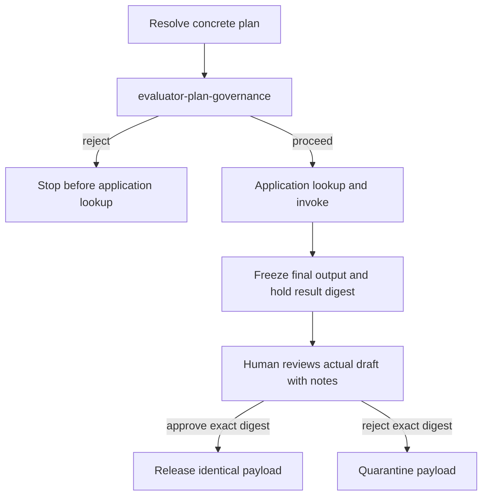

# Architecture

A small, container-shaped, readable AOA system. This is a reference
implementation for learning the shape of AOA, not a deployment platform. It
keeps the moving parts explicit: Sessions 1 and 2 establish three workflows,
three agent codebases, nine AU capabilities, three deterministic tools, and
three plumbing services. The parser codebase is deployed as separate governed
parser runtimes so Session 2 can show that new Agent IDs plus new capability
contracts and `instructions.md` files create materially different agents
without changing parser code. AU-to-AU orchestration uses A2A Agent Cards and
JSON-RPC `message/send`; deterministic tools expose MCP tools behind small
registered AOA bridges.

Session 3 adds a fourth workflow authored with
[Vercel EVE](https://github.com/vercel/eve). The learner accepts the TypeScript
agent in native EVE before adopting it as an ordinary AU through the same
registry, A2A surface, and studio. Course runtime infrastructure lives under
`agents-eve/runtime/`; learner files live under `agents-eve/workshop/`. See
[`EVE.md`](EVE.md).

Session 4 adds two evidence workflows around CV fit and a cross-workflow
control plane. Studio presents exactly three core governance stages:
`agent-card-check`, `cv-fit`, and `flow-audit`. Optional Graph and Ask utilities
support evidence exploration without adding governance stages: Graph visualizes
the seeded EU AI Act wiki, while Ask runs the grounded `knowledge-query`
workflow with inspectable passage citations and tool retrieval. The planner
uses deterministic course plans and invokes `evaluator-plan-governance` before
application lookup or invocation. An ineligible employment plan is rejected; an
eligible plan runs application AUs to an immutable held draft. A human reviews
the actual output and approves or rejects its exact `result_digest`, releasing
the identical draft or quarantining it. The wiki store is an explicit,
inspectable governance/evidence knowledge plane for cited Annex III and Article
14 rationale. Studio disables wiki reset in Session 4 to protect that corpus;
missing evidence is restored by rerunning the seed script.

## What the system does

Six workflows run through one registry:

**CV evaluation** (Session 1):

```
parser-cv → evaluator-cv → reporter-cv-fit
```

You submit a CV and a job description through the studio. The planner queries
the registry for `parser-cv` and starts it with A2A `message/send`; the parser
returns structured CV data. The planner then starts `evaluator-cv` with the
parsed CV and the job description; the evaluator returns scores and a verdict.
Finally the planner starts `reporter-cv-fit`, which produces a structured
fit-verdict report. Every step is visible in the studio's trace pane.

**CV fit + interview** (Session 3) extends that evaluation with a learner-authored
EVE capability:

```text
parser-cv → evaluator-cv → interviewer-questions
```

The learner first accepts the agent through native EVE. Adoption generates its
capability card when missing, starts AOA, and exposes the accepted implementation
through the same governed A2A boundary as the Python AUs.

**Knowledge ingest** (Session 2) starts the wiki-management loop:

```
parser-notes → evaluator-promote → reporter-ingest-summary
```

You submit source material through the studio. The parser extracts citeable
passages and concepts. The evaluator decides which material should be promoted
into the course wiki. The reporter writes the promoted layer through
`tool-wiki-store` and returns a Markdown ingest summary.

**Knowledge query** (Session 2) then uses the stored wiki:

```
parser-query → evaluator-wiki-query → reporter-answer
```

You submit a question through the studio. The parser turns it into a compact
retrieval query. The evaluator searches the wiki store and ranks retrieved
passages. The reporter writes a grounded answer from those retrieved passages,
with passage-id citations. For this reference implementation the final wiki
answer is deliberately deterministic over retrieved evidence, so the demo shows
grounding rather than a model free-writing from prior knowledge.

**Agent card check** (Session 4) reads current declared evidence:

```text
parser-estate → evaluator-agent-evidence → reporter-agent-evidence
```

`parser-estate` reads the registry card inventory through `tool-filesystem`.
`evaluator-agent-evidence` evaluates declarations and visibly retrieves
verbatim regulation passages through `tool-wiki-store`.
`reporter-agent-evidence` renders each exact query, passage ID, source, complete
quote, and card finding. Green means declared evidence only, not an implemented
control or legal conclusion.

**Flow audit** (Session 4) reads post-execution evidence:

```text
parser-estate → evaluator-flow-evidence → reporter-flow-audit
```

`parser-estate` reconstructs observed planner JSONL records.
`evaluator-flow-evidence` checks eligibility, event order, exact-result review,
release or quarantine, and released-payload equality. `reporter-flow-audit`
renders that evidence with a complete Article 14 citation, without treating
card declarations as execution. The Studio panel defaults to employment traces
carrying the current `human-review-before-release` result-governance model.
Older employment traces remain persisted but hidden; the **Show legacy
history** checkbox includes them and reports the included count. A red legacy row means current
evidence is absent, not necessarily that the old execution failed.

Every Session 4 workflow passes through post-resolution eligibility first:



The CV-fit intent declares employment/candidate use. Deterministic eligibility
requires the selected `evaluator-cv` review declaration, a result-release
control, and citeable Annex III employment and Article 14 wiki passages; a
missing requirement fails closed before application work. Once eligible, the
current application AUs perform only read/compute/draft work because holding a
result cannot undo external side effects. Agent card check and Flow audit do not
carry the employment composition and complete automatically.

## Seven things this system demonstrates

Each is something you can see on screen as you build:

1. **An Agentic Unit is `model + capability + instructions.md + maybe tools`.** Some AUs have no tools — the reporter is the example. Read any agent folder to see all four parts.
2. **A registered capability isn't always an AU.** The tools in `tools/` register in the same registry the agents use. The registry holds capabilities; whether they're fulfilled by an AU over A2A or by a deterministic tool exposed through MCP is a property of the entry, not of the registry.
3. **One codebase can become more than one governed agent.** `cv-parser` and `wiki-parser` run the same parser image, same `agent.py`, same model, and same document-text tool. Different Agent IDs, capability cards, and `instructions.md` files make them different governed agents with different contracts.
4. **Identity and behaviour are separate.** `agent_id` is the stable governed runtime actor shown in the registry and trace. Registry lifecycle actors such as `published_by` and `approved_by` show who moved a card through governance. `instructions.md` shapes a capability's working behaviour, and `skills_hash` records which behavioural version produced an observation.
5. **The architecture is indifferent to where reasoning happens.** Switch from a local smaller model to a hosted OpenAI-compatible endpoint through `.env`; nothing else changes.
6. **Intent and use context are first-class surfaces.** The studio is how a human hands intent and declared use context into the system. The architecture is a layered handover: intent → planning/validation → discovery/selection → resolved plan and digest → composition governance → A2A orchestration → tool.
7. **Declarations, eligibility, exact-result review, execution evidence, and legal claims are independent.** Agent card evidence describes a public declaration; `evaluator-plan-governance` decides pre-execution eligibility; a human reviews the actual held output; Flow audit checks the observed release or quarantine path. None establishes legal compliance or effective human oversight.

## The agent set

Three Python agent codebases, deployed as five distinct governed runtimes by
Session 4:

| Runtime | Codebase | Capabilities |
|---|---|---|
| `cv-parser` | `parser` | `parser-cv` |
| `wiki-parser` | `parser` | `parser-notes`, `parser-query` |
| `estate-parser` | `parser` | `parser-estate` |
| `evaluator` | `evaluator` | `evaluator-cv`, `evaluator-promote`, `evaluator-wiki-query`, `evaluator-plan-governance`, `evaluator-agent-evidence`, `evaluator-flow-evidence` |
| `reporter` | `reporter` | `reporter-cv-fit`, `reporter-answer`, `reporter-ingest-summary`, `reporter-agent-evidence`, `reporter-flow-audit` |

Session 3 adds one more governed runtime, authored with EVE (TypeScript/Node)
instead of the Python scaffold:

| Runtime | Learner codebase | Capabilities |
|---|---|---|
| `eve-workshop-interviewer` | `agents-eve/workshop` (EVE) | `interviewer-questions` |

Reusable image and bridge infrastructure is kept separately under
`agents-eve/runtime/`. `session3-up` runs only the native EVE workshop;
`session3-adopt` generates the card when missing and starts the governed runtime
through the same registry and A2A surface as the Python agents. See
[`EVE.md`](EVE.md).

Plus, in `tools/`:

| Tool | Registered as | Type |
|---|---|---|
| filesystem MCP server | `tool-filesystem` | non-AU registered capability |
| document text MCP server | `tool-document-text` | non-AU registered capability |
| wiki store MCP server | `tool-wiki-store` | non-AU registered capability |

## The four parts of an AU

Every AU has four addressable parts plus a stamped runtime identity:

1. **Capability card** (`capability-card.yaml`) — the contract. Public. Mounted read-only in the container, exposed at `/cards/<id>`, and **hot-reloaded** when its host file changes.
2. **`instructions.md`** — practical know-how for fulfilling the capability: prompt structure, judgement rubric, examples, edge cases. Mounted read-only and **hot-reloaded** — editing it on disk changes the capability's behaviour without a restart.
3. **`tools.yaml`** — the capability ids this agent will call. May reference other AUs or pure tools. May be empty.
4. **`agent.py`** — the wiring. Built on the shared FastAPI scaffold in `agents/_base/`.

At boot the shared scaffold stamps each card with `agent_id` and `identity`
from the container environment. In this course compose file those are stable
URNs such as `urn:aoa:agent:cv-parser` and
`urn:aoa:agent:wiki-parser`.

When a single Python codebase backs more than one capability, the
capability-specific files live in `capabilities/<name>/` subfolders; the code
lives at the agent root. Every Python agent uses this pattern even when it has
only one capability. Session 3 deliberately shows another ownership model:
EVE-authored files and the generated card stay in `agents-eve/workshop/`, while
the generic adoption runtime stays in `agents-eve/runtime/`. Card edits there
require rerunning `session3-adopt`.

## Plumbing services

| Service | Job |
|---|---|
| **registry** | Loads capability cards on startup. Watches `cards.json` for changes. Stamps demo governance lifecycle actors (`published_by`, `approved_by`, reviewer/deprecation fields). Exposes direct lookup, listing, and deterministic capability discovery over HTTP. |
| **planner** | Receives intents from Studio. Builds and validates a plan, resolves concrete cards, runs deterministic eligibility before application lookup, sequences eligible AU work with A2A `message/send`, freezes the final draft, and releases or quarantines it after exact-result review. Records all control and application events to `traces/<event-id>.jsonl`. |
| **studio** | Browser surface at `localhost:8080`. Shows registry, resolved work, eligibility and wiki evidence, responsibility trace, held draft, result digest, reviewer notes, and release/quarantine outcome; submits exact-result review and subscribes to registry/trace SSE. |

## Container topology

Each agent and each service runs in its own container. Compose orchestrates.

```
docker-compose.yml services:

  registry             FastAPI    7100
  planner              FastAPI    7200
  studio               FastAPI    8080
  cv-parser            FastAPI    8888 (host: 7301)
  wiki-parser          FastAPI    8888 (host: 7304)
  estate-parser        FastAPI    8888 (host: 7306; Session 4)
  evaluator            FastAPI    8888 (host: 7302)
  reporter             FastAPI    8888 (host: 7303)
  tool-filesystem      MCP        7401
  tool-document-text   MCP+bridge 7402
  tool-wiki-store      MCP+bridge 7403
  ollama               profile: local, optional
```

Session 1 starts the CV-only subset: registry, planner, studio,
tool-document-text, `cv-parser`, evaluator, and reporter. Session 2 adds
`wiki-parser` and the knowledge tools. Session 3 begins differently:
`session3-up` runs only the native EVE workshop, and `session3-adopt` then starts
the AOA services and generic EVE bridge around the learner's accepted files.
Session 4 adds `estate-parser`, enables the plan-governance, agent-evidence,
and flow-evidence capabilities, exposes read-only registry/trace mounts to
`tool-filesystem`, presents three core governance stages plus optional Graph and
Ask evidence utilities, and sets the planner strategy to deterministic. The
wiki tool remains explicit in AU tool traces and evidence reports. Optional
Ollama runs only when the `local` profile is enabled.

Every agent container has the same shape: a FastAPI app that mounts its
`capabilities/` folder as a volume, registers itself with the registry on boot,
exposes `/a2a`, `/.well-known/agent-card.json`, `/invoke`, and `/cards/<id>`,
and watches mounted capability cards and `instructions.md` files for hot
reload. Read one agent and you've read them all.

## A2A surface

Each AU process publishes a genuine A2A Agent Card at
`/.well-known/agent-card.json`. Inside the Docker network these resolve to
container-local addresses such as
`http://cv-parser:8888/.well-known/agent-card.json`, and the card's `url`
points at `http://cv-parser:8888/a2a`. The card includes standard A2A fields such as
`protocolVersion`, `url`, `preferredTransport`, default input/output modes, and
`skills`. The A2A core card identifies the service surface, but this course
also needs a governed actor identity for policy and audit. The scaffold exposes
that as an AOA extension (`urn:aoa:extensions:agent-identity:v1`) and stamps
the same `agent_id` onto each registered capability card. A2A skills are
intentionally lighter than AOA capability cards, so the full capability-card
contracts are advertised through a second A2A extension.

The planner still uses the AOA registry to ground concrete capabilities. In
this small course registry only approved cards are discoverable. The planner
sends compact AU capability summaries to the planner model and asks for a JSON
task plan. The runtime validates that the plan uses registered capabilities,
maps required inputs, references only available prior outputs, and ends in a
markdown-producing result. If validation fails, the deterministic course plan
is used; Session 4 skips model planning and uses deterministic plans directly.

After discovery binds every task to a card, the planner records the concrete
plan and computes a 16-character SHA-256 `plan_digest` over canonical workflow,
intent, release policy, resolved dataflow, and each selected card's governance
snapshot. It invokes `evaluator-plan-governance` before application `lookup` or
`invoke`. Deterministic policy makes the eligibility decision; inspectable wiki
searches supply Annex III and Article 14 rationale. Missing required employment
evidence rejects the plan before application work.

Eligible employment AUs run to a frozen final draft. The planner computes a
16-character `result_digest` over `plan_digest` and those outputs, then records
`result-draft` and `result-hold`. Studio requires the reviewer to inspect the
actual draft, add notes, and approve or reject that exact digest. Approval copies
the identical payload into `result-release`; rejection records
`result-quarantine` and releases no result. A digest mismatch receives HTTP
`409`. Agent card check and Flow audit complete automatically.

When a released application card includes `a2a_endpoint`, the planner sends a
JSON-RPC 2.0 request to that endpoint:

```json
{
  "jsonrpc": "2.0",
  "method": "message/send",
  "params": {
    "message": {
      "kind": "message",
      "role": "user",
      "parts": [
        {
          "kind": "data",
          "data": {
            "inputs": {}
          }
        }
      ],
      "metadata": {
        "aoa_capability": "parser-cv",
        "trace_id": "..."
      }
    }
  }
}
```

The agent replies with an A2A message. The structured AOA envelope lives in a
`DataPart` so the planner can keep the same trace and workflow code. Reporter
agents may also include a text part containing markdown for inline rendering.
`/invoke` remains available as a compatibility endpoint and as the AOA bridge
surface used by deterministic MCP-backed tools.

## Capability card schema

```yaml
id: evaluator-wiki-query
version: 0.1.0
kind: au                            # or "tool" for non-AU registered capabilities
purpose: |
  Search wiki passages for a user question and return a cited evidence
  evaluation.
inputs:
  - name: question
    type: string
    required: true
  - name: query
    type: object
    required: true
outputs:
  - name: parsed_note
    type: structured-note
  - name: ranked_passages
    type: array
  - name: direct_answer_possible
    type: boolean
constraints:
  - ranked_passages cite passage ids returned by tool-wiki-store.
  - parsed_note includes passages so reporter-answer can cite evidence.
evaluation_signals:
  - valid_output_shape
  - passages_have_citations
  - latency_p95_under(8s)
provenance:
  model: ${MODEL}
  skills_hash: <sha of instructions.md>
agent_id: urn:aoa:agent:evaluator
identity:
  agent_id: urn:aoa:agent:evaluator
  agent_name: evaluator
  runtime: docker-compose
  principal: urn:aoa:agent:evaluator
lifecycle:
  status: approved
  published_by: urn:aoa:role:platform-team-publisher
  approved_by: urn:aoa:role:risk-curator-approver
  deprecated_by: ""
  replaced_by: ""
endpoint: http://evaluator:8888/invoke
agent_card_url: http://evaluator:8888/.well-known/agent-card.json
a2a_endpoint: http://evaluator:8888/a2a
```

The evaluator capability cards differ in `purpose`, `inputs`, `outputs`,
`constraints`, `evaluation_signals`, `instructions.md`, and the registered
endpoints. They share `agent.py` and `model`. Pure tools have `kind: tool` and
`provenance.model: none`; they register `endpoint` only.

This reference system treats `constraints` as the public promise to inspect and
discuss. It implements focused output-shape and signal checks in each agent
rather than a generic policy engine that enforces every constraint string.

## The studio

A browser surface at `localhost:8080` with two roles:

**Observation:**

- **Registry pane.** Live listing of every registered capability — capability
  id, Agent ID, lifecycle status, publisher/approver actors, version, kind
  (`au` or `tool`), and current `skills_hash`. Updates as capabilities
  register, deregister, or change.
- **Intent Studio pane.** The currently running flow as a visual lifecycle: intent, available capability context, resolved task plan, deterministic eligibility and wiki evidence, application work, immutable draft and result digest, human review, release/quarantine, and rendered result. Raw event payloads remain available in expandable details.
- **Right detail pane.** Click any registry entry to see its capability card, or
  click a wiki graph node to inspect that document, concept, passage, or open
  question.

**Intent:**

- **Submit an intent.** Free-form text, sent to the planner.
- **Choose a mode.** CV fit for Session 1; ingest, graph, and wiki query for
  Session 2; CV fit + interview after Session 3 adoption; three core governance
  stages (Agent card check, CV fit, and Flow audit) plus optional Graph and Ask
  evidence exploration in Session 4.
- **Review a held result.** Inspect the actual draft, add required reviewer notes,
  then approve or reject its exact `result_digest`. Approval releases the
  identical draft; rejection quarantines it.
- **Drop a file.** Drag a CV, job description, or research note into the relevant field.
- **Inspect the wiki graph.** The wiki store projects its raw, promoted, and
  indexed knowledge into typed graph nodes. Documents, concepts, passages, and
  open questions use different shapes and colours. In Session 4, optional Graph
  visualizes the seeded EU AI Act corpus; it is not part of the governance arc.
- **Ask grounded questions.** Optional Session 4 Ask runs the `knowledge-query`
  workflow against that corpus and exposes passage citations and tool retrieval.
  It is not a governance stage.

The studio is for observing and driving the system. In Session 4, Agent card
check exposes exact wiki queries and citations, eligible CV fit runs to a held
draft, and Flow audit checks exact-result review. Flow audit hides persisted
older employment traces by default; the **Show legacy history** checkbox
includes them and reports their count. Wiki reset is disabled to protect the governance corpus;
rerun the Session 4 seed script if evidence is missing. Runtime data is
bind-mounted for inspection: `system/inbox/` holds submitted inputs,
`system/wiki/` holds the wiki `raw/`, `promoted/`, and `index.json` layers,
`system/services/planner/traces/` holds JSONL traces, and
`system/services/registry/data/cards.json` holds live registry state.

Held drafts are different: their active `PreparedRun` objects, frozen outputs,
and locks live only in planner memory. Restarting planner leaves trace files but
loses the draft needed for result review. This course implementation is not
production workflow persistence, crash recovery, or crash-idempotent review.

## Running locally

Use Docker Compose profiles to start the part of the system needed for the
session.

Session 1 starts only the CV-fit path:

```bash
docker compose --env-file .env \
  -f system/docker-compose.yml \
  -f system/docker-compose.session1.yml \
  --profile session1 \
  up --build -d --remove-orphans
```

Session 2 starts the full knowledge-management path:

```bash
docker compose --env-file .env \
  -f system/docker-compose.yml \
  --profile session2 \
  up --build -d --remove-orphans
```

For Session 3, pre-build with `session3-build`, open only the native EVE
workshop with `session3-up`, and start the composed AOA system only after native
acceptance with `session3-adopt`. These are the public Session 3 entry points;
the guided sequence is in [`agents-eve/EXERCISE.md`](agents-eve/EXERCISE.md).

For Session 4, start the deterministic stack with three core stages plus
optional Graph and Ask evidence exploration, then seed and verify the inspectable
governance/evidence corpus.

macOS or Linux:

```bash
./scripts/session4-up.sh
./scripts/session4-seed.sh
```

Windows Command Prompt:

```bat
scripts\session4-up.bat
scripts\session4-seed.bat
```

Open `http://localhost:8080` after starting an AOA stack and you'll see the
registry pane populate as agents and tools register.

Configure the model via `.env`:

```
PROVIDER=ollama|openai|anthropic
MODEL=...
OPENAI_BASE_URL=...   # optional for OpenAI-compatible hosted providers
```

The intended baseline is a smaller model, for example `gpt-oss:120b` or a
Qwen-family model, run locally through Ollama or through a service provider.
Switching model, provider, or hosting location is a `.env` change and a
Compose restart away. The registry, the agents, the capability cards, and the
planner all stay still.
