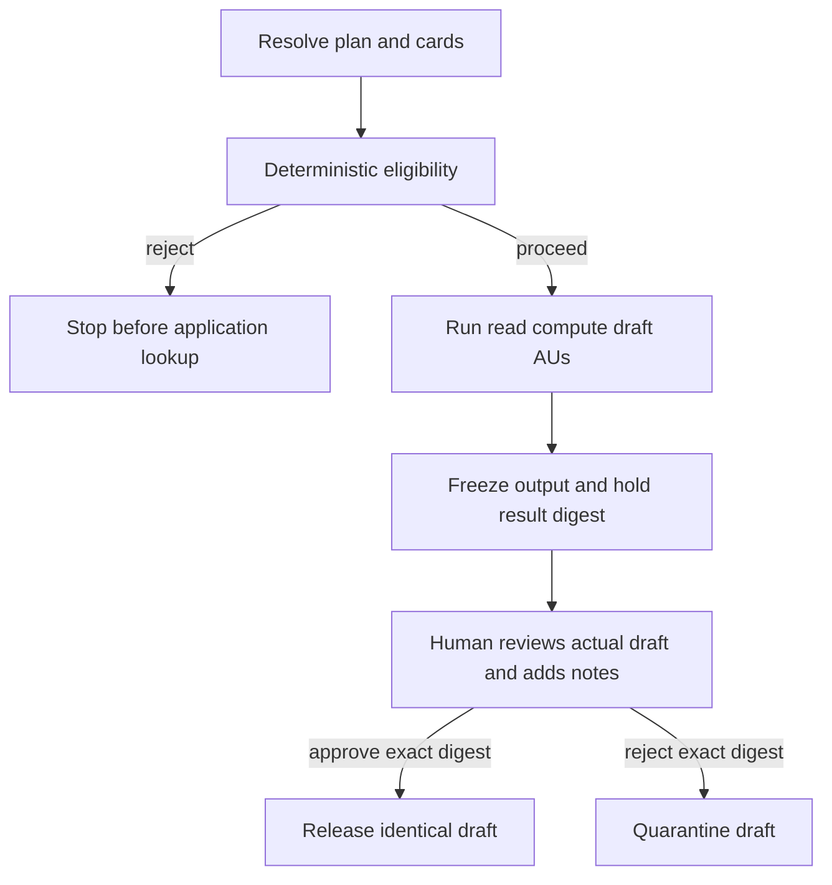

# planner

The planner turns an intent into a concrete plan, resolves registered
capabilities, checks pre-execution eligibility, orchestrates application AUs,
and controls release of the completed result. It owns the correlated JSONL
trace.

The base system uses hybrid model planning with deterministic validation and
fallback. Session 4 sets `PLANNER_STRATEGY=deterministic`, so every enabled
workflow uses its fixed course plan.

## Workflows

```text
cv-fit:             parser-cv → evaluator-cv → reporter-cv-fit
cv-fit-interview:   parser-cv → evaluator-cv → interviewer-questions
knowledge-ingest:   parser-notes → evaluator-promote → reporter-ingest-summary
knowledge-query:    parser-query → evaluator-wiki-query → reporter-answer
agent-card-check:   parser-estate → evaluator-agent-evidence → reporter-agent-evidence
flow-audit:         parser-estate → evaluator-flow-evidence → reporter-flow-audit
```

## Session 4 Studio surface

Session 4 has exactly three core governance stages: Agent card check, CV fit,
and Flow audit. Studio also exposes optional Graph and Ask evidence-exploration
utilities. Graph visualizes the seeded EU AI Act wiki. Ask invokes the grounded
`knowledge-query` workflow so learners can inspect passage citations and tool
retrieval. Neither utility is another governance stage. Wiki reset is disabled
in Session 4 to protect the governance corpus; rerun the Session 4 seed script
if evidence is missing.

## Session 4 lifecycle

For each Session 4 intent, the planner:

1. Selects the deterministic task plan and resolves each task to a concrete
   capability card.
2. Records the plan, its `plan_digest`, and a release policy. Employment-shaped
   plans use `human-review-before-release`.
3. Invokes `evaluator-plan-governance` before any application AU `lookup` or
   `invoke`. Its deterministic policy checks employment context, the selected
   `evaluator-cv` review-before-use declaration, and the result-release control.
   `tool-wiki-store` supplies inspectable Annex III and Article 14 rationale.
4. Fails closed with `reject` if the employment declaration, release control,
   Annex III passage, or Article 14 passage is missing. Rejected plans run no
   application AU. Eligible plans record `governance-release` and proceed.
5. Runs the application AUs. For current CV fit these are read/compute/draft
   operations only; result hold cannot undo an external side effect.
6. Freezes the final AU output, computes `result_digest`, and records
   `result-draft` plus `result-hold`. The draft is not released.
7. Accepts a human `approve` or `reject` only with reviewer notes and the exact
   held `result_digest`. Approval records `result-review`, releases the identical
   draft in `result-release`, and finishes `released`. Rejection records
   `result-review`, then `result-quarantine`, and finishes `quarantined` without
   a released result.



The wiki is an explicit governance/evidence knowledge plane, not the decision
engine. Deterministic policy makes the eligibility decision; wiki searches make
its Annex III and Article 14 rationale citeable and inspectable. Missing either
employment-governance passage causes a closed rejection.

## Digests

`plan_digest` is the first 16 hexadecimal characters of SHA-256 over canonical
JSON containing the workflow, intent, release policy, resolved tasks/dataflow,
and selected-card governance snapshots. It correlates eligibility with the
resolved composition.

`result_digest` is the first 16 hexadecimal characters of SHA-256 over canonical
JSON containing `plan_digest` and the frozen final outputs. Human review binds
to this digest because the reviewer must see and decide on the actual result,
not merely the plan that produced it.

A wrong result digest receives HTTP `409`. Before release, the planner recomputes
the digest over the frozen draft; approval then copies that same payload to the
released outputs.

These digests are course integrity and correlation mechanisms, not signatures
or authorization credentials.

## Held-run state

Trace files persist under `/data/traces/`, bind-mounted to
`system/services/planner/traces/`. Active `PreparedRun` objects, immutable draft
payloads, and per-run locks live in planner memory. Restarting the planner leaves
trace evidence on disk but loses the active draft required for review. Submit a
new intent after a restart.

This implementation does not provide production workflow persistence, crash
recovery, replay protection, or crash-idempotent review.

## Endpoints

| Method | Path | Body | Returns |
|---|---|---|---|
| `POST` | `/intent` | `{ "kind": "...", "use_context": {...}, "inputs": {...} }` | trace ID, workflow, status, and outputs or held draft metadata |
| `GET` | `/runs/{trace_id}` | — | active in-memory run, draft, digest, review, and released outputs |
| `POST` | `/runs/{trace_id}/review` | `decision`, exact `result_digest`, required `review_notes` | released or quarantined run snapshot |
| `POST` | `/runs/{trace_id}/approval` | compatibility alias for `/review` using the same result-review body | released or quarantined run snapshot |
| `POST` | `/trace-events` | AU/tool trace record | `{ "ok": true }` |
| `GET` | `/events` | — | SSE stream of trace records |
| `GET` | `/traces` | — | recent persisted trace IDs |
| `GET` | `/traces/{id}` | — | persisted trace as a JSON array |
| `GET` | `/healthz` | — | workflows and planner strategy |

## Trace format

An eligible, approved employment result records this order:

```json
{"step":"plan","plan_digest":"...","release_policy":{"mode":"human-review-before-release"}}
{"step":"governance-invoke","capability":"evaluator-plan-governance","plan_digest":"..."}
{"step":"plan-governance","decision":"proceed","plan_digest":"..."}
{"step":"governance-release","decision":"proceed","plan_digest":"..."}
{"step":"lookup","capability":"parser-cv","card":{}}
{"step":"invoke","capability":"parser-cv","inputs":{}}
{"step":"response","capability":"reporter-cv-fit","outputs":{}}
{"step":"result-draft","plan_digest":"...","result_digest":"...","outputs":{}}
{"step":"result-hold","result_digest":"...","review_required":true}
{"step":"result-review","decision":"approve","result_digest":"...","review_notes":"..."}
{"step":"result-release","result_digest":"...","outputs":{}}
{"step":"finish","outputs":{}}
```

A rejected review records `result-quarantine` instead of `result-release` and
emits no result payload. An ineligible employment plan records `plan-rejected`
before any application `lookup` or `invoke`.

Flow audit reconstructs eligibility, event order, exact-result review,
release/quarantine, and released-payload equality from these records. Its Studio
panel defaults to employment traces carrying the current
`human-review-before-release` result-governance model. Older employment traces
remain persisted but hidden; the **Show legacy history** checkbox includes them
and reports the included count. Red legacy rows mean current evidence is absent, not
necessarily that the old execution failed. Legacy `hold`, `plan-approval`, and
`resume` events remain parseable, but never count as `result-review` evidence.

## Planning configuration

The planner runs on port `7200` and expects
`REGISTRY_URL=http://registry:7100`.

`PLANNER_STRATEGY` controls plan construction:

- `hybrid` — ask the model, validate, and fall back if needed.
- `deterministic` — skip the model and use the built-in course plan. Session 4
  uses this strategy.
- `llm` — require a valid model-generated plan; fail if validation fails.

`PLAN_GOVERNANCE_CAPABILITY` enables the pre-execution eligibility check. The
configured card must be an approved AU. If the evaluator is unavailable or its
output is invalid, employment execution fails closed with rejection.
