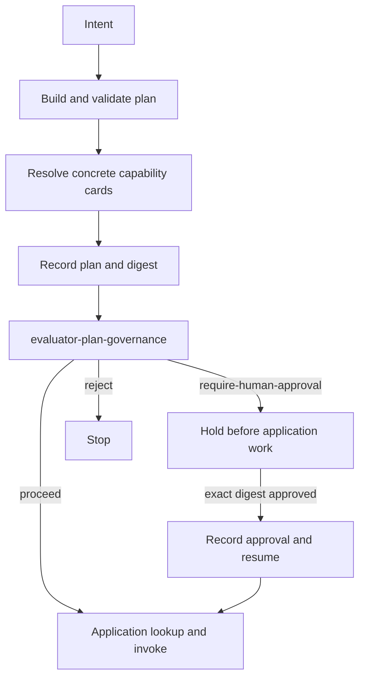

# planner

The planner turns an intent into a concrete task plan, resolves each task to a
registered capability, evaluates the resolved composition, and then
orchestrates application AUs. It owns the correlated JSONL trace.

By default the base system uses a hybrid planning strategy: a model proposes a
plan, deterministic validation accepts it or falls back to a built-in course
plan. Session 4 sets `PLANNER_STRATEGY=deterministic` so every enabled workflow
uses its fixed course plan before the governance gate runs.

## Workflows

```text
cv-fit:             parser-cv → evaluator-cv → reporter-cv-fit
cv-fit-interview:   parser-cv → evaluator-cv → interviewer-questions
knowledge-ingest:   parser-notes → evaluator-promote → reporter-ingest-summary
knowledge-query:    parser-query → evaluator-wiki-query → reporter-answer
agent-card-check:   parser-estate → evaluator-agent-evidence → reporter-agent-evidence
flow-audit:         parser-estate → evaluator-flow-evidence → reporter-flow-audit
```

The knowledge query remains conservative: the wiki store searches indexed
passages, `evaluator-wiki-query` ranks retrieved passage IDs, and
`reporter-answer` builds the answer from that evidence rather than free-writing.

## Resolution, governance, and execution

For each intent the planner:

1. Loads current registry cards and builds or selects a task plan.
2. Validates the task plan, discovers candidates, and binds every task to a
   concrete capability card.
3. Records the resolved `plan` and computes its `plan_digest`.
4. If `PLAN_GOVERNANCE_CAPABILITY` is configured, invokes that control-plane AU
   with the workflow, declared `use_context`, resolved plan, selected card
   snapshots, and digest.
5. Applies the returned operational decision before any application capability
   `lookup` or `invoke`:
   - `proceed`: record `governance-release` and execute.
   - `require-human-approval`: record `hold` and return without running an
     application AU.
   - `reject`: record rejection and finish without application execution.
6. On exact-digest approval, records `plan-approval` and `resume` on the same
   trace, then executes the already resolved plan.
7. Threads each application AU's outputs into the next task and records the
   final result.

Session 4 configures `evaluator-plan-governance` and exposes exactly
`agent-card-check`, `cv-fit`, and `flow-audit` in Studio. Its deterministic
policy returns `require-human-approval` for the CV employment use context.
Agent card check and Flow audit do not match that employment-and-consequence
policy and auto-proceed.



The governance decision is an operational course release decision. Agent card
evidence is a declaration, while Flow audit is post-execution evidence for the
gate, digest, ordering, resume, and completion. Neither surface, and no release
decision, establishes legal compliance, certification, legal permission, or
effective human oversight.

## Plan digest

`plan_digest` is the first 16 hexadecimal characters of SHA-256 over canonical
JSON containing the workflow, full intent, resolved task/capability/dataflow,
and each selected card's governance snapshot: identity/version, purpose,
input/output contracts, constraints, evaluation signals, lifecycle, provenance,
and endpoints. It binds a review to the displayed plan and selected component
evidence.

`POST /runs/{trace_id}/approval` requires that exact digest. A wrong digest
receives HTTP `409`. Before accepting approval, the planner also compares every
selected card's current governance snapshot with the snapshot bound into the
held digest. If a card changed while the plan was held, approval receives HTTP
`409`; the learner submits a new intent and reviews its new digest.

This digest is a course correlation mechanism, not a signature or production
authorization credential.

## Held-run state

Trace files persist under `/data/traces/`, bind-mounted to
`system/services/planner/traces/`. Held run objects and per-run locks do not:
they live in the planner process's in-memory `state.runs` and `state.run_locks`.
Restarting the planner therefore makes an earlier held trace unavailable to the
run/approval endpoints even though its JSONL evidence remains on disk.

This implementation does not provide production workflow persistence, crash
recovery, replay protection, or crash-idempotent resume. After a restart,
submit a new intent and approve its new digest.

## Endpoints

| Method | Path | Body | Returns |
|---|---|---|---|
| `POST` | `/intent` | `{ "kind": "...", "use_context": {...}, "inputs": {...} }` | trace ID, workflow, status, and outputs |
| `GET` | `/runs/{trace_id}` | — | in-memory active-run snapshot |
| `POST` | `/runs/{trace_id}/approval` | decision (`approve` or `reject`), `plan_digest`, and optional reason | updated active-run snapshot; approval may execute synchronously |
| `POST` | `/trace-events` | AU/tool trace record | `{ "ok": true }` |
| `GET` | `/events` | — | SSE stream of trace records |
| `GET` | `/traces` | — | recent persisted trace IDs |
| `GET` | `/traces/{id}` | — | persisted trace as a JSON array |
| `GET` | `/healthz` | — | workflows and planner strategy |

## Trace format

Each trace is JSON Lines. The Session 4 governance sequence appears between the
resolved plan and application work:

```json
{"step":"plan","plan_digest":"...","plan":[...]}
{"step":"governance-invoke","capability":"evaluator-plan-governance","plan_digest":"..."}
{"step":"plan-governance","decision":"require-human-approval","plan_digest":"..."}
{"step":"hold","approval_required":true,"plan_digest":"..."}
{"step":"plan-approval","decision":"approve","actor_id":"...","plan_digest":"..."}
{"step":"resume","actor_id":"...","plan_digest":"..."}
{"step":"lookup","capability":"parser-cv","card":{...}}
{"step":"invoke","capability":"parser-cv","inputs":{...}}
{"step":"response","capability":"parser-cv","outputs":{...},"signals":{...}}
```

A plan that auto-proceeds records `governance-release` instead of hold,
approval, and resume. AUs also post `au-start`, inward tool boundary events, and
`au-finish` on the same trace while the orchestrator waits.

Flow audit reads these persisted records only after execution. Its
`parser-estate → evaluator-flow-evidence → reporter-flow-audit` path reports
evidence for the gate, exact digest, ordering, resume, and completion; it does
not infer execution from Agent card declarations.

## Planning configuration

The planner runs on port `7200` and expects
`REGISTRY_URL=http://registry:7100`.

`PLANNER_STRATEGY` controls plan construction:

- `hybrid` — ask the model, validate, and fall back if needed.
- `deterministic` — skip the model and use the built-in course plan. Session 4
  uses this strategy.
- `llm` — require a valid model-generated plan; fail if validation fails.

`PLAN_GOVERNANCE_CAPABILITY` enables the post-resolution, pre-execution gate.
The configured card must be an approved AU. If it is unavailable, not approved,
not an AU, or returns an invalid decision or digest, the planner fails closed to
`require-human-approval` for course review.
